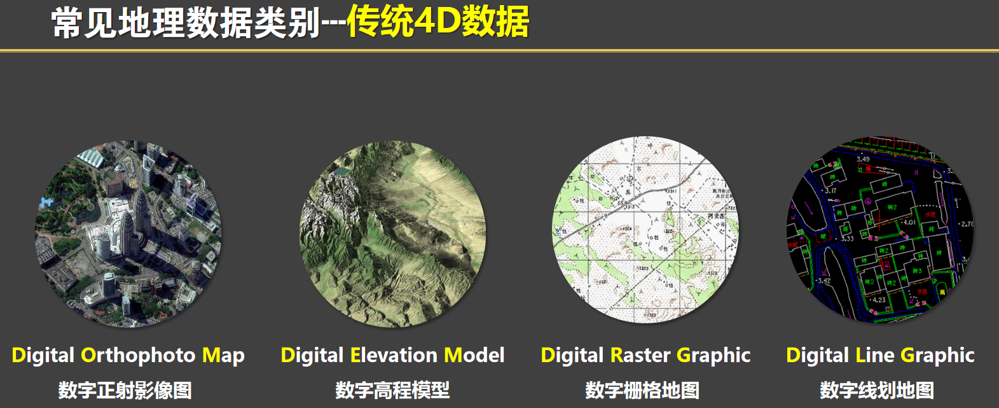
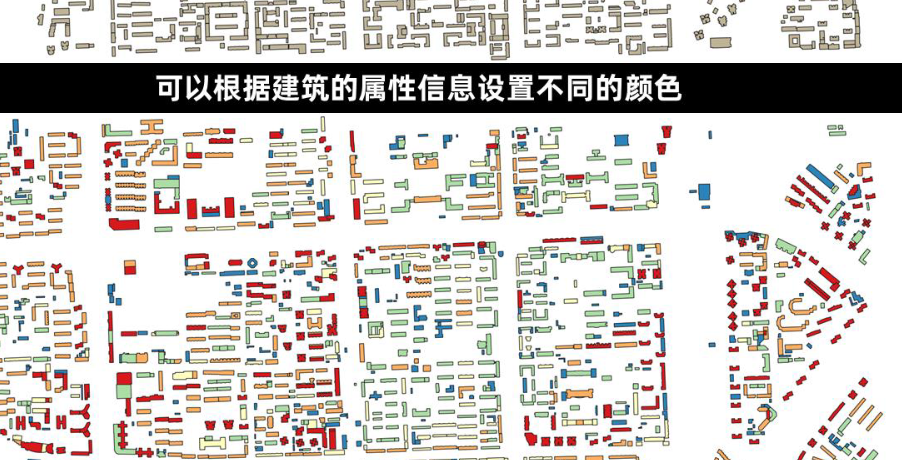

# 地理爱好者大探索

anyway， 这是我想要（很有兴趣）努力学习，制作的一个东西！

慢慢来，一点一点来！

## 测绘概述

什么是测绘：

1. 传统模拟测绘
2. 数字测绘
3. 信息化测绘
从生产纸质地图，到综合信息化产品， 技术手段有实地勘察、RTK、全站仪、遥感

遥感信息需要经过很多步骤才能制作为数字地图

## what is Mapbox

[mapbox](http://Mapbox.com) 是一个很棒的地图制作及分享网站，用户可以使用Mapbox Studio创建一个自定义、交互式的地图，然后可以将这些自定义的地图和数据服务你自己的网站(Web)或移动应用程序(Mobile Web/Android/IOS)上。

## 夸克网盘中有好多资源 -- 似乎用微信登陆的

人家推荐学习资源：

分享一些学习资料
Kepler.gl可视化入门指南
资源下载地址：<https://pan.quark.cn/s/84c63ae51edf>
<https://pan.xunlei.com/s/VNcKDISEmKCt0FiVVx04o1ouA1?pwd=qx75#>

QGIS入门指南
<https://pan.quark.cn/s/81c1a045408b>
<https://pan.xunlei.com/s/VNcKDNa_AQwQFFWFi3rA3N62A1?pwd=geyq>

神奇地图艺术制作说明书
<https://pan.quark.cn/s/dfbaef837e14>
<https://pan.xunlei.com/s/VNcKDSu_p6DeZgJqbcTWk9nzA1?pwd=gxre>

GIS应用实践-数据篇-引言-系统中常见数据类型
<https://pan.quark.cn/s/93dc233ccb3b>
<https://pan.xunlei.com/s/VNcUPgKqe2ryS9sAsHW5_oZwA1?pwd=dbac>

## todo

想做一个定位and record 的安卓程序
了解坐标系

## GIS应用实践教程—数据篇

4D数据分别的是DOM、DEM、DLG和DRG，我们平常接触较多的是DOM和DEM

数字正射影像图

空三加密？

q: 栅格矢量化

介绍如何下载爬取这些数据

## what is qGIS

A Free and Open Source Geographic Information System

Create, edit, visualise, analyse and publish geospatial information

